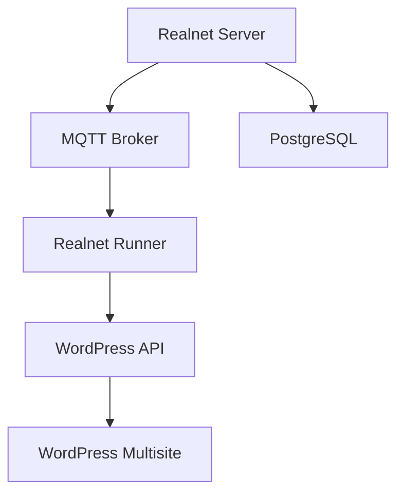

# Realnet WordPress Integration

This project integrates WordPress multisite with realnet, enabling content management through realnet's type system and message queue processing.

## Components

### WordPress Provider

The WordPress provider enables managing WordPress content through realnet's type system:

- `Website` - Represents a WordPress multisite instance
- `WebPage` - Represents a WordPress page
- `WebPost` - Represents a WordPress post

### WordPress Plugin

The WordPress plugin (`realnet-wordpress/`) provides:

- REST API endpoints for content synchronization
- JWT authentication for secure API access
- Custom templates for realnet-managed content
- Multisite support

### Runner Integration

The runner component processes messages from realnet's message queue:

- Uses MQTT as the default message broker
- Handles content synchronization between realnet and WordPress
- Supports create/update/delete operations for all content types

## Configuration

### Environment Variables

```bash
# WordPress Configuration
REALNET_WORDPRESS_URL=http://wordpress:8081
REALNET_WORDPRESS_ADMIN_USER=admin
REALNET_WORDPRESS_ADMIN_PASS=admin
REALNET_WORDPRESS_TOKEN=realnet-wordpress-jwt-key

# MQTT Configuration
REALNET_MQTT_HOST=mosquitto
REALNET_MQTT_PORT=1883
REALNET_MQTT_TOPIC=realnet/tasks

# Database Configuration
REALNET_DB_HOST=postgresql
REALNET_DB_PORT=5432
REALNET_DB_NAME=realnet
REALNET_DB_USER=realnet
REALNET_DB_PASS=realnet
```

### Kubernetes Deployment

The system is deployed using Kubernetes:

```bash
# Deploy all components
kubectl apply -k k8s/base

# Access WordPress admin
open http://wordpress.local:8081/wp-admin

# Access realnet
open http://localhost:8080
```

## Development

### Adding New Content Types

1. Define the type in `realnet/static/initialization/websites.json`
2. Create corresponding views in `realnet/static/initialization/websites_apps.json`
3. Update the WordPress plugin to handle the new type
4. Update the runner script to process the new type

### Runner Scripts

Runner scripts are Python modules that process messages from the queue:

```python
def handle_message(message):
    """Process incoming message"""
    data = json.loads(message)
    # Handle message...
    publish({
        'status': 'success',
        'data': result
    })
```

### WordPress Templates

Custom templates can be added to `realnet-wordpress/templates/`:

```php
<?php
// templates/realnet-page.php
get_header();
$content = $GLOBALS['realnet_content'];
?>
<article>
    <h1><?php echo esc_html($content['title']); ?></h1>
    <div class="content">
        <?php echo apply_filters('the_content', $content['content']); ?>
    </div>
</article>
<?php
get_footer();
```

## Architecture



The system uses:
- MQTT for message queuing
- JWT for API authentication
- WordPress multisite for content management
- PostgreSQL for realnet data storage

## Contributing

1. Fork the repository
2. Create a feature branch
3. Make your changes
4. Submit a pull request

## License

This project is licensed under the MIT License - see the LICENSE file for details.
