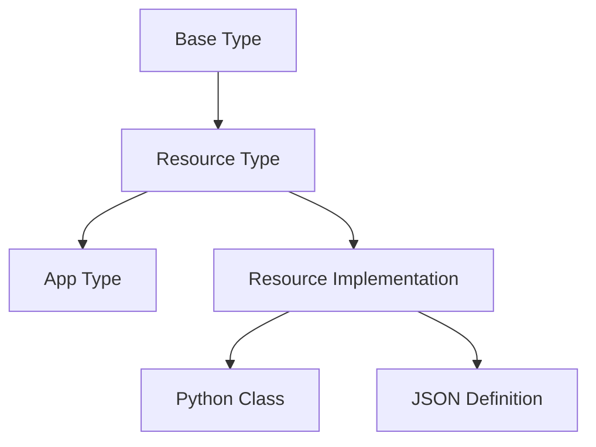

# Realnet Type System Guide

This guide provides comprehensive documentation for working with Realnet's Type and Instance system. It covers both high-level concepts and low-level implementation details to help you effectively use Realnet in your domain model.

## Table of Contents
- [Conceptual Overview](#conceptual-overview)
- [Technical Implementation](#technical-implementation)
- [Best Practices](#best-practices)
- [Examples](#examples)

## Conceptual Overview

### Type System Architecture



### Core Concepts

1. **Types**
   - Foundation of Realnet's object model
   - Define structure and behavior
   - Support inheritance through base types
   - Contain attributes and instances
   - Can be extended into specialized forms (Resource Types, App Types)

2. **Instances**
   - Concrete implementations of Types
   - Inherit attributes from their Type
   - Can override and extend Type attributes
   - Form the basis for Items in the system

3. **Resources**
   - Special Types that interface with providers
   - Handle data storage and retrieval
   - Implement standard CRUD operations
   - Support custom operations through endpoints

### Type Hierarchy

The type system follows a strict hierarchy:

1. Base Types (core.json)
   - Fundamental system types
   - Core functionality
   - Base attributes

2. Resource Types (domain.json)
   - Domain-specific resources
   - Provider integration
   - Basic attributes only

3. App Types (domain_apps.json)
   - UI and interaction
   - Views and queries
   - Can reference resource types

### Attribute Propagation

Attributes flow through the type system following these rules:

1. Type Inheritance
   - Base type attributes are inherited
   - Derived types can add or override attributes
   - Multiple inheritance is not supported

2. Instance Inheritance
   - Instances inherit all type attributes
   - Instance attributes override type attributes
   - Changes to type affect all instances

## Technical Implementation

### Core Classes

1. **Type Class**
```python
class Type:
    def __init__(self, id, name, base=None, attributes=dict(), 
                 instances=[], module=None, types=dict()):
        self.id = id
        self.name = name
        self.base = base
        self._attributes = attributes
        self._instances = instances
        self.module = module
        self.types = types

    def is_derived_from(self, type_name):
        if type_name.lower() == self.name.lower():
            return True
        elif self.base:
            return self.base.is_derived_from(type_name)
        return False
```

2. **Instance Class**
```python
class Instance(Type):
    def __init__(self, id, type, name, attributes=dict()):
        self.id = id
        self.type = type
        self.name = name
        self._attributes = attributes

    def _get_attributes(self):
        return (self.type.attributes | self._attributes 
                if self._attributes 
                else self.type.attributes)
```

3. **Resource Class**
```python
class Resource(ABC):
    @abstractmethod
    def get(self, module, args, endpoint, path=None, 
            content_type='text/html'):
        pass

    @abstractmethod
    def post(self, module, args, endpoint, path=None, 
             content_type='text/html'):
        pass

    # Additional CRUD methods...
```

### JSON Type Definitions

1. **Basic Type Definition**
```json
{
  "name": "MyType",
  "base": "BaseType",
  "attributes": {
    "icon": "file",
    "module": "my_module",
    "description": "My custom type"
  }
}
```

2. **Resource Type Definition**
```json
{
  "name": "MyResource",
  "base": "Resource",
  "attributes": {
    "icon": "database",
    "module": "my_resources",
    "provider": "sql"
  }
}
```

3. **App Type Definition**
```json
{
  "name": "MyApp",
  "base": "App",
  "attributes": {
    "icon": "app",
    "views": [
      {
        "name": "default",
        "query": {
          "type": "MyResource"
        }
      }
    ]
  }
}
```

## Best Practices

### Type Definition

1. **Organization**
   - Keep resource types in domain.json
   - Place app types in domain_apps.json
   - Maintain separation of concerns

2. **Attributes**
   - Use descriptive names
   - Document purpose and usage
   - Keep resource types minimal
   - Put UI logic in app types

3. **Inheritance**
   - Choose appropriate base types
   - Don't create deep inheritance chains
   - Favor composition over inheritance

### Resource Implementation

1. **Provider Integration**
```python
class MyResource(Resource):
    def __init__(self, provider):
        self.provider = provider

    def get_items(self, module, args):
        return self.provider.get_items(args)

    def get_item(self, module, id):
        return self.provider.get_item(id)
```

2. **Error Handling**
```python
def get_items(self, module, args):
    try:
        items = self.provider.get_items(args)
        return items
    except ProviderError as e:
        logging.error(f"Provider error: {e}")
        raise ResourceError(f"Failed to get items: {e}")
    except Exception as e:
        logging.error(f"Unexpected error: {e}")
        raise
```

### Integration Steps

1. Create Python Implementation
```python
class CustomerResource(Resource):
    def __init__(self, provider):
        self.provider = provider

    def get_items(self, module, args):
        return self.provider.query("SELECT * FROM customers")

    def get_item(self, module, id):
        return self.provider.query_one(
            "SELECT * FROM customers WHERE id = %s", 
            [id]
        )
```

2. Define Type in JSON
```json
{
  "name": "Customer",
  "base": "Resource",
  "attributes": {
    "icon": "user",
    "module": "crm",
    "provider": "sql"
  }
}
```

3. Create App Integration
```json
{
  "name": "CustomerApp",
  "base": "App",
  "attributes": {
    "icon": "users",
    "views": [
      {
        "name": "list",
        "query": {
          "type": "Customer"
        }
      }
    ]
  }
}
```

## Examples

### Basic Type Example

1. Define the Type
```python
customer_type = Type(
    id="customer_type",
    name="Customer",
    attributes={
        "email": "",
        "phone": "",
        "status": "active"
    }
)
```

2. Create an Instance
```python
customer = Instance(
    id="customer1",
    type=customer_type,
    name="John Doe",
    attributes={
        "email": "john@example.com",
        "phone": "555-0123"
    }
)
```

### Resource Type Example

1. Implementation
```python
class CustomerResource(Resource):
    def __init__(self, provider):
        self.provider = provider
        
    def get_items(self, module, args):
        query = """
            SELECT id, name, email, phone, status 
            FROM customers
            WHERE org_id = %(org_id)s
        """
        return self.provider.query(query, args)
        
    def get_item(self, module, id):
        query = """
            SELECT id, name, email, phone, status
            FROM customers 
            WHERE id = %(id)s
        """
        return self.provider.query_one(query, {"id": id})
        
    def create_item(self, module, args):
        query = """
            INSERT INTO customers (name, email, phone, status)
            VALUES (%(name)s, %(email)s, %(phone)s, %(status)s)
            RETURNING id
        """
        return self.provider.execute(query, args)
```

2. Type Definition (customers.json)
```json
{
  "name": "Customer",
  "base": "Resource",
  "attributes": {
    "icon": "user",
    "module": "crm",
    "provider": "sql",
    "fields": [
      {
        "name": "email",
        "type": "string",
        "required": true
      },
      {
        "name": "phone",
        "type": "string"
      },
      {
        "name": "status",
        "type": "string",
        "default": "active"
      }
    ]
  }
}
```

3. App Integration (crm_apps.json)
```json
{
  "name": "CustomerManager",
  "base": "App",
  "attributes": {
    "icon": "users",
    "module": "crm",
    "views": [
      {
        "name": "list",
        "title": "Customers",
        "query": {
          "type": "Customer",
          "sort": "name"
        }
      },
      {
        "name": "detail",
        "title": "Customer Details",
        "query": {
          "type": "Customer",
          "id": "${id}"
        }
      }
    ],
    "forms": [
      {
        "name": "create",
        "title": "New Customer",
        "type": "Customer",
        "fields": ["name", "email", "phone"]
      },
      {
        "name": "edit",
        "title": "Edit Customer",
        "type": "Customer",
        "fields": ["name", "email", "phone", "status"]
      }
    ]
  }
}
```

### Implementation Guidelines

1. **Type Creation**
   - Define clear boundaries
   - Include necessary attributes
   - Consider inheritance needs
   - Document type purpose

2. **Resource Implementation**
   - Use appropriate provider
   - Implement CRUD methods
   - Handle errors properly
   - Consider performance

3. **App Integration**
   - Create meaningful views
   - Define clear queries
   - Configure proper forms
   - Set up navigation

4. **Testing**
   - Verify type behavior
   - Test instance creation
   - Validate resource operations
   - Check app functionality

Remember:
- Types define structure
- Instances provide data
- Resources handle storage
- Apps manage interaction
- Keep dependencies one-way
- Document everything clearly

This guide should provide a solid foundation for working with Realnet's type system. Follow these patterns and practices to create maintainable and effective implementations.
