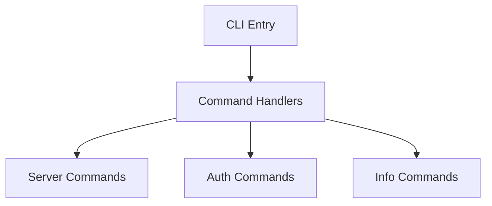
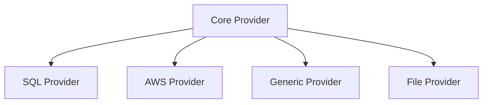
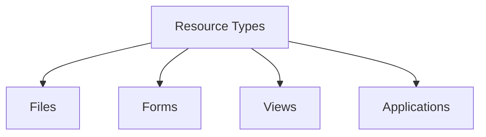
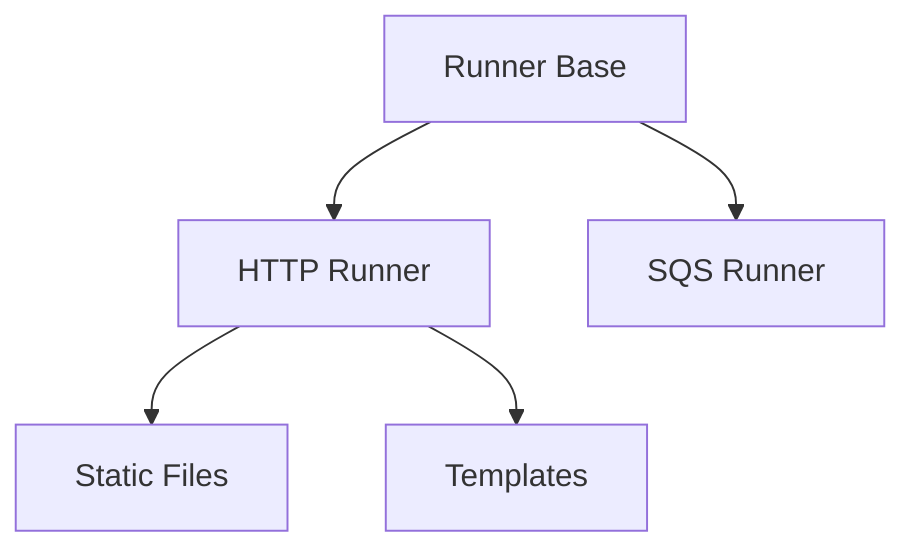
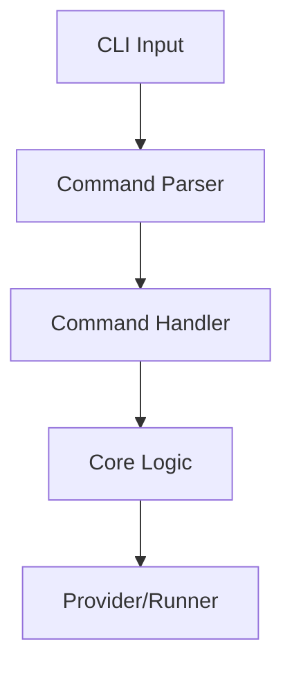
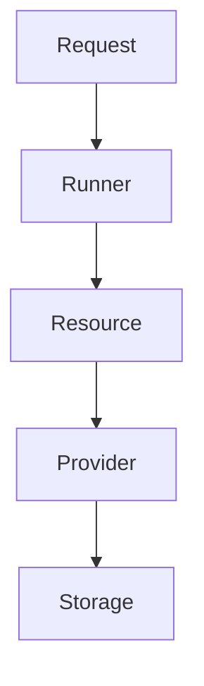
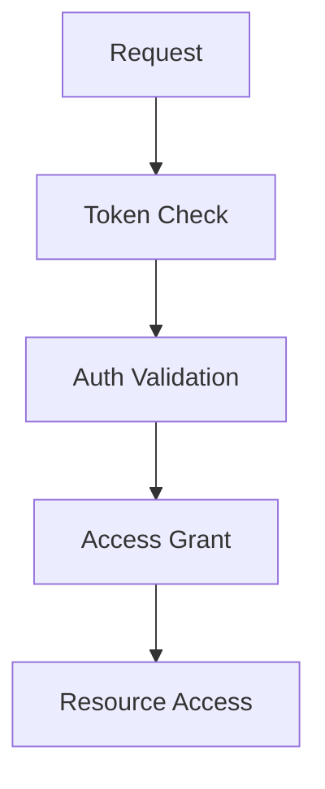

# System Patterns

## Architecture Overview

### Core Components

1. Command System

2. Provider System

3. Resource System

4. Runner System

### Design Patterns

1. Command Pattern
- Centralized command handling
- Modular command implementation
- Consistent CLI interface
- Command validation

2. Provider Pattern
- Abstract provider interface
- Multiple backend support
- Storage agnostic operations
- Consistent data access

3. Resource Pattern
- Type-based resources
- File handling
- Form management
- View rendering

4. Runner Pattern
- Protocol abstraction
- Service integration
- Template handling
- Static file serving

## Component Relationships

### Command Flow

### Data Flow

### Authentication Flow

## Implementation Guidelines

1. Command Implementation
- Use cmd/ directory structure
- Implement command handlers
- Follow CLI patterns
- Handle errors consistently

2. Provider Implementation
- Follow provider interface
- Implement storage backends
- Handle transactions
- Manage connections

3. Resource Implementation
- Define resource types
- Handle file operations
- Manage templates
- Process forms

4. Runner Implementation
- Handle protocols
- Serve static files
- Process templates
- Manage services

These patterns guide development and ensure system consistency.
