# System Patterns

## Architecture Overview

### WordPress Deployment Pattern

1. Component Structure
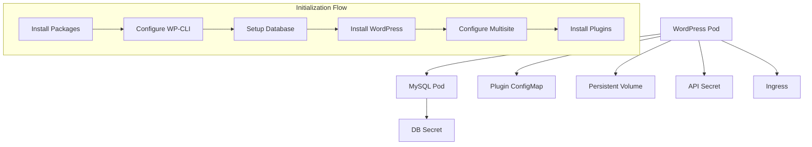

2. Configuration Pattern
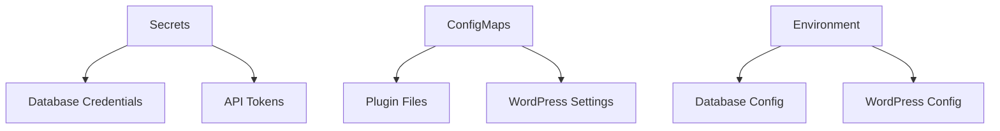

3. Plugin Integration Pattern
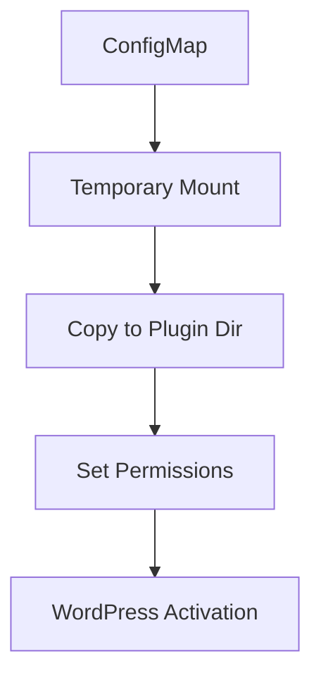

4. Startup Sequence
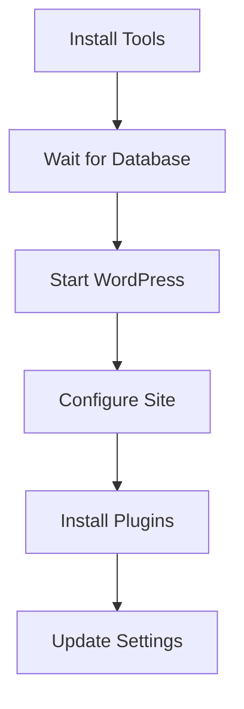

### Core Components

1. Command System
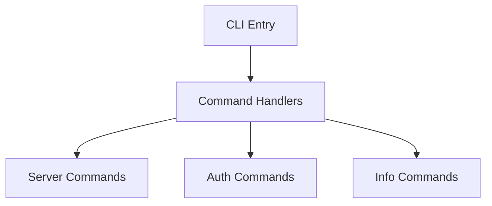

2. Provider System
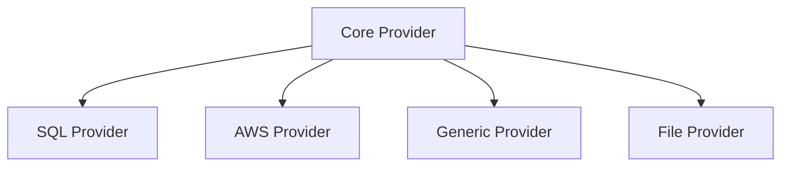

3. Resource System
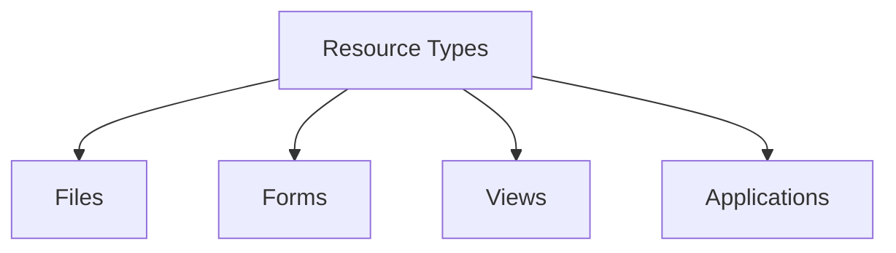

4. Runner System
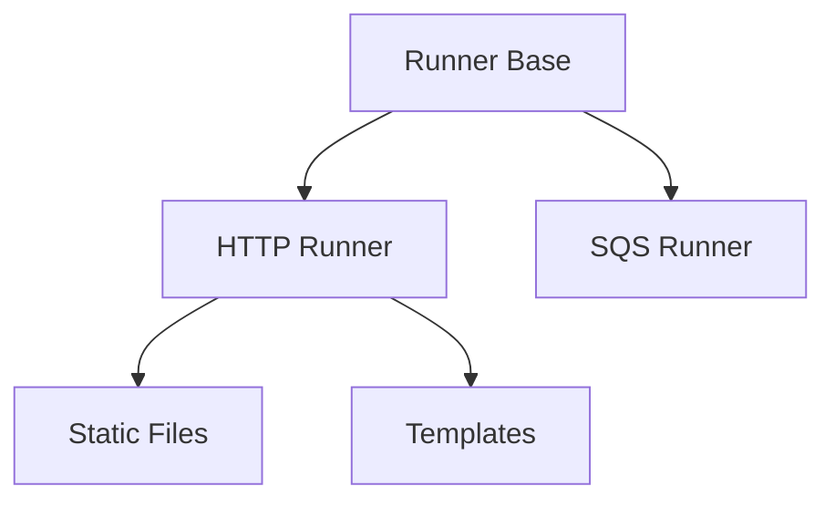

### Design Patterns

1. Command Pattern
- Centralized command handling
- Modular command implementation
- Consistent CLI interface
- Command validation

2. Provider Pattern
- Abstract provider interface
- Multiple backend support
- Storage agnostic operations
- Consistent data access

3. Resource Pattern
- Type-based resources
- File handling
- Form management
- View rendering

4. Runner Pattern
- Protocol abstraction
- Service integration
- Template handling
- Static file serving

## Component Relationships

### Command Flow
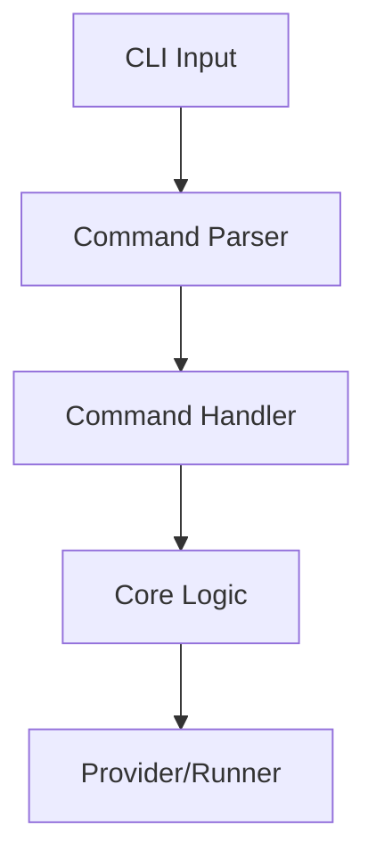

### Data Flow
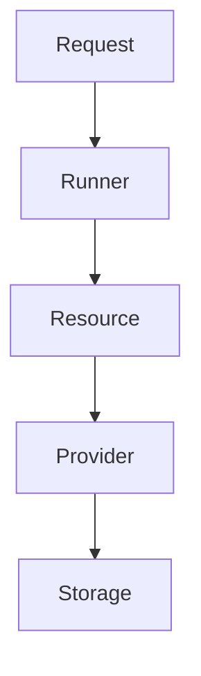

### Authentication Flow
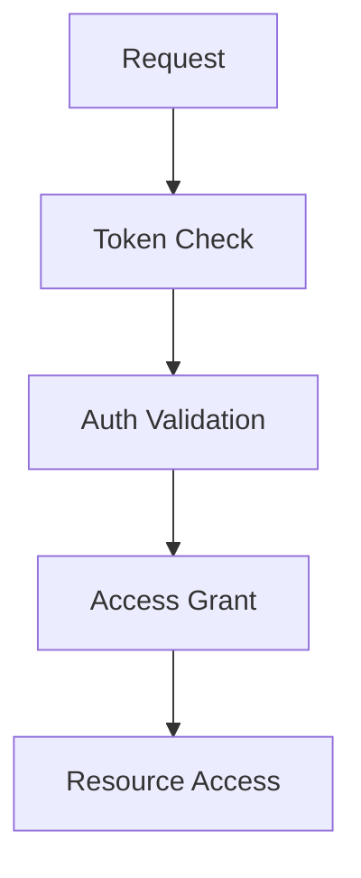

## Resource Creation Pattern

1. Resource Implementation
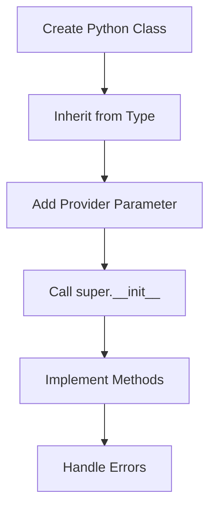

2. Resource Definition
```mermaid
graph TD
    A[Create JSON Type] --> B[Set Module Attribute]
    B --> C[Add Basic Attributes]
    C --> D[Add to Resource JSON]
    D --> E[Add to Initialization]

    subgraph Type System Dependencies
        F[Core Types] --> G[Resource Types]
        G --> H[App Types]
        H -.-> |Can Reference| G
        G -.- x|Avoid Reference| H
    end

    subgraph View Organization
        I[Resource Type] --> J[Basic Attributes]
        K[App Type] --> L[Views]
        L --> M[Query Resource Types]
        M -.-> I
        I -.- x|No Views| L
    end
```

Key Rules:
- Resource types go in domain JSONs (kubernetes.json)
  * Basic attributes only (icon, module)
  * No views or queries
- App types go in domain_apps.json
  * All views and queries
  * Can reference resource types
- General app types in apps.json
- This separation prevents circular dependencies

3. Resource Integration
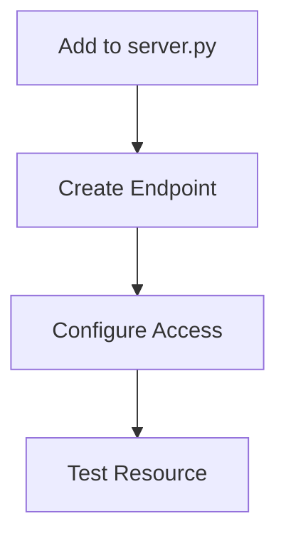

## App Creation Pattern

1. App Structure
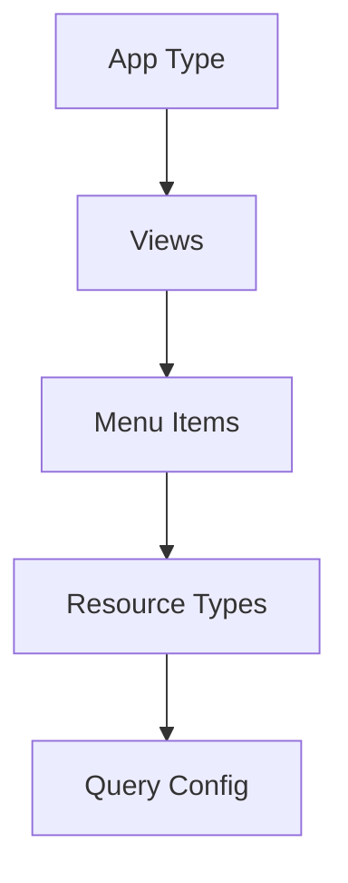

2. App Definition Steps
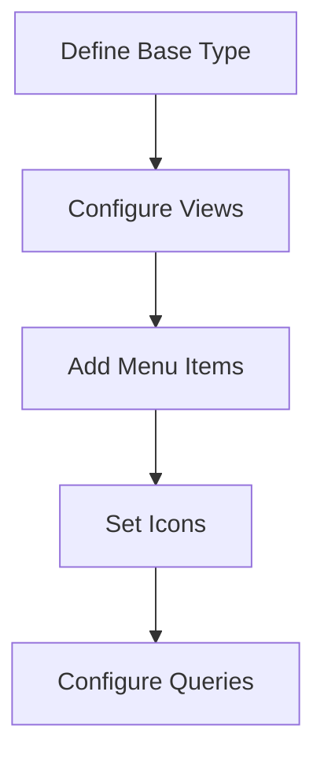

3. App Integration
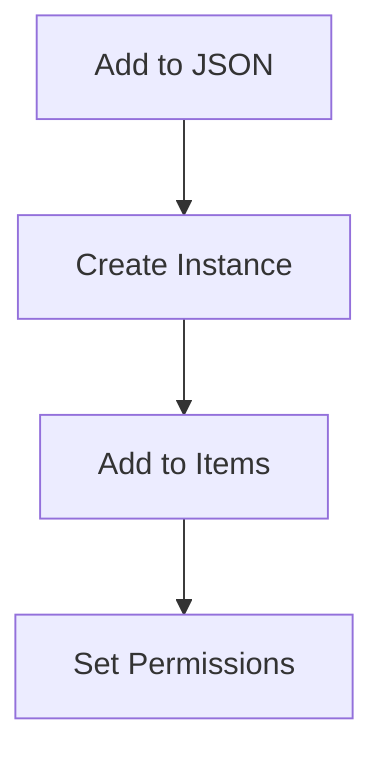

## Implementation Guidelines

1. Resource Implementation
- Create resource class in resource/
- Inherit from Type base class
- Implement required methods
- Add error handling
- Configure provider

2. JSON Definition
- Define types in initialization/
- Set module and icon attributes
- Configure views and queries
- Add resource endpoints
- Set up app integration

3. App Creation
- Define app type
- Configure views and menus
- Add app instance
- Set icons and queries
- Handle permissions

4. Integration Steps
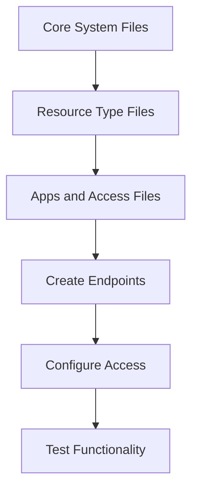

Key Initialization Order:
1. Core System Files
   - core.json: Base types
   - controls.json: UI controls
   - views.json: View definitions
   - forms.json: Form definitions
   - geometry.json: Layout definitions

2. Resource Type Files
   - kubernetes.json: K8s resources
   - crm.json: CRM resources
   - Other domain resources

3. Apps and Access Files
   - apps.json: App definitions
   - access.json: Access control

This order ensures dependencies exist before they're referenced.

These patterns guide development and ensure system consistency.
