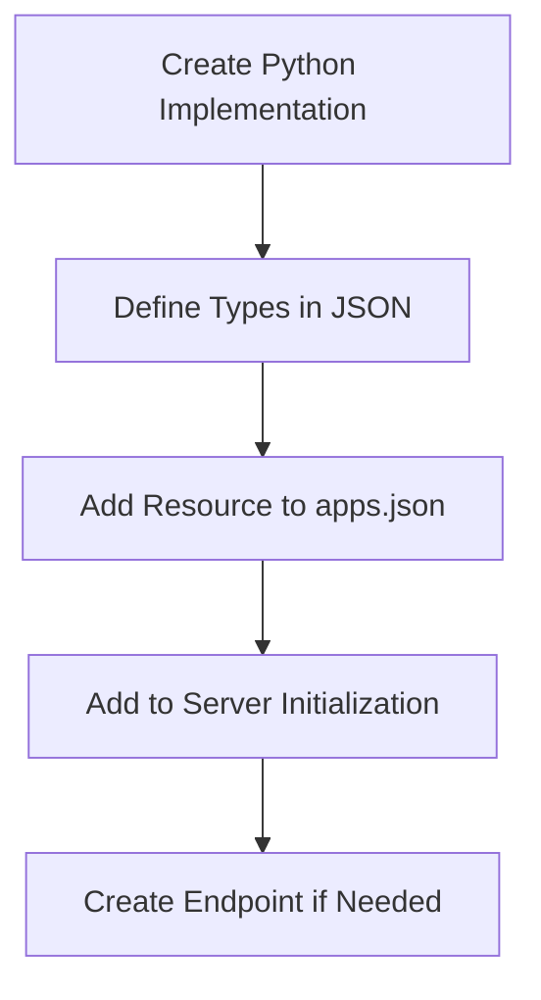
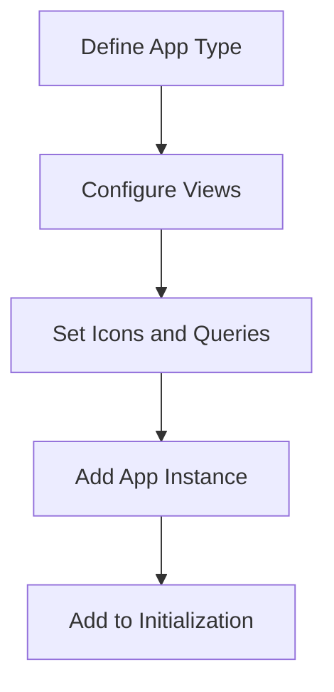
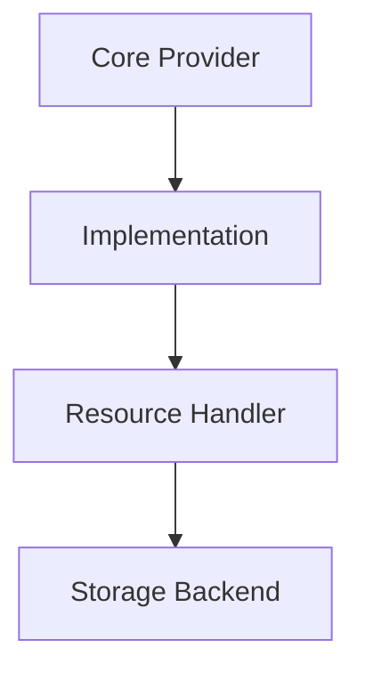
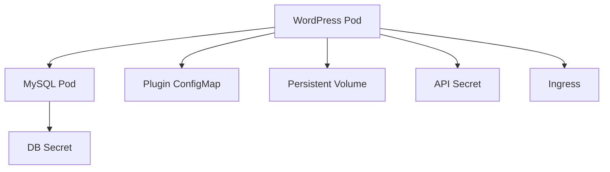

# Technical Context

## Technology Stack

### Core Technologies
- Python 3.x
- PostgreSQL Database
- AWS Services (S3, SQS)
- HTTP/REST APIs
- Docker/Kubernetes
- WordPress (Multisite)

### Key Dependencies
- PostgreSQL client
- AWS SDK
- Cryptography module
- HTTP server
- Template engine
- Kubernetes client

## Development Setup

### Project Structure
```
realnet/
├── cmd/           # Command line interface
│   ├── create.py
│   ├── get.py
│   ├── info.py
│   ├── runner.py
│   └── server.py  # Server initialization and resource loading
├── core/          # Core functionality
│   ├── acl.py
│   ├── config.py
│   ├── hierarchy.py
│   ├── provider.py  # Base provider classes
│   └── type.py    # Base type system
├── provider/      # Storage providers
│   ├── aws/
│   ├── generic/
│   ├── json/
│   ├── sql/
│   ├── xml/
│   └── yaml/
├── resource/      # Resource types
│   ├── files/
│   ├── forms/
│   ├── views/
│   ├── cluster/   # K8s integration
│   └── ...
├── runner/        # Protocol runners
│   ├── http/
│   └── sqs/
├── shell/         # Shell interface
├── static/        # Static resources
│   └── initialization/  # Resource definitions
│       ├── core.json
│       ├── apps.json
│       ├── kubernetes.json
│       └── ...
└── templates/     # HTML templates
```

### Resource Architecture

1. Resource Types
- Resources are defined in initialization JSON files
- Each resource has a Python implementation and JSON type definition
- Resources can be exposed through endpoints
- Resources can be grouped into apps

2. Type System
```mermaid
graph TD
    A[Base Type] --> B[Resource Type]
    B --> C[App Type]
    B --> D[Resource Implementation]
    D --> E[Python Class]
    D --> F[JSON Definition]

    subgraph Type Dependencies
        G[Core Types] --> H[Resource Types]
        H --> I[App Types]
        I -.-> |Can Reference| H
        H -.- x|Must Not Reference| I
    end
```

Type System Rules:
- Core types provide base functionality (Item, Resource, etc.)
- Resource types extend core types for domain logic
- App types provide UI and interaction
- Dependencies flow from core → resources → apps
- Apps can reference resource types (e.g. in queries)
- Resource types must not reference app types
- Each layer has its own initialization file
- Initialization order follows dependency flow

3. Resource Creation Pattern


4. App Creation Pattern


### Provider System

1. Provider Types
- ContextProvider: Main provider interface
- Type Provider: Handles type system
- Resource Provider: Manages resources
- Data Provider: Handles storage

2. Provider Pattern


3. Provider Creation Steps
- Implement provider interface
- Register with context
- Define resource mappings
- Configure storage backend

### Environment Setup
```
REALNET_SERVER_HOST='0.0.0.0'
REALNET_SERVER_PORT='8080'
REALNET_DB_TYPE=postgresql
REALNET_DB_USER=<username>
REALNET_DB_PASS=<password>
REALNET_DB_HOST=<host>
REALNET_DB_PORT=<port>
REALNET_DB_NAME=<dbname>
REALNET_STORAGE_TYPE='s3'
REALNET_STORAGE_S3_BUCKET=<bucket>
REALNET_STORAGE_S3_KEY=<key>
REALNET_STORAGE_S3_SECRET=<secret>
REALNET_STORAGE_S3_REGION=<region>
```

### WordPress Integration

1. Deployment Architecture


2. Component Structure
- WordPress Container
  * Base Image: wordpress:6.4-apache
  * WP-CLI for management
  * Plugin integration via ConfigMap
  * Multisite configuration
  * Custom startup script

- MySQL Database
  * Base Image: mysql:8.0
  * Persistent storage
  * Secret management
  * Health checks

3. Configuration Management
- Secrets:
  * wordpress-db-secret: Database credentials
  * wordpress-api-secret: Admin and JWT tokens
- ConfigMaps:
  * realnet-plugin: WordPress plugin files
- Environment Variables:
  * WORDPRESS_DB_HOST
  * WORDPRESS_DB_USER
  * WORDPRESS_DB_PASSWORD
  * WORDPRESS_DB_NAME
  * WORDPRESS_CONFIG_EXTRA

4. Networking Setup
- Services:
  * WordPress: LoadBalancer on port 8081
  * MySQL: ClusterIP on port 3306
- Ingress:
  * Host: wordpress.local
  * Path: /
  * Port: 8081

5. Storage Configuration
- WordPress:
  * PVC for wp-content
  * ConfigMap for plugin files
- MySQL:
  * PVC for database files

6. Plugin Integration
- Mount Strategy:
  * ConfigMap to temporary location
  * Copy to wp-content/plugins
  * Set proper permissions
- Plugin Types:
  * JWT Authentication
  * Advanced Custom Fields
  * REST API Menus
  * Members

## Technical Constraints

1. Database
- PostgreSQL compatibility
- Transaction support
- Connection pooling
- Schema management

2. Storage
- S3 bucket access
- File handling
- MIME type support
- Upload/download management

3. Security
- Token authentication
- Environment variables
- Secure storage
- Access control

4. Deployment
- Docker support
- Kubernetes compatibility
- Environment isolation
- Service configuration

## Dependencies

### System Requirements
- Python 3.x
- PostgreSQL
- gcc/g++
- Development tools

### Python Dependencies
- setuptools-rust
- cryptography
- database drivers
- AWS SDK
- HTTP server
- kubernetes client

### External Services
- PostgreSQL database
- AWS S3 storage
- AWS SQS queue
- Kubernetes cluster
- (Optional) ChatGPT API

### Development Tools
- Python virtual environment
- Database client
- AWS CLI
- Docker/Kubernetes CLI

## Resource Creation Guidelines

1. Python Implementation
- Create resource class inheriting from Type
- Implement required methods (get_items, get_item, etc.)
- Use appropriate provider type
- Handle errors properly
- Receive provider in __init__ (required for resource instantiation)

2. JSON Definition
- Define types in initialization JSON
- Set module and icon attributes
- Configure views and queries
- Add resource endpoints

3. App Integration
- Add app type definition
- Configure views and menu items
- Add app instance to items
- Set proper icons and queries

4. Initialization
- Add JSON file to server.py in correct order:
  1. Core System Files
     * core.json: Base type system
     * controls.json: UI control definitions
     * views.json: View system definitions
     * forms.json: Form system definitions
     * geometry.json: Layout system
  2. Resource Type Files
     * Domain-specific resources (kubernetes.json, crm.json)
     * Only contain resource type definitions
     * No app type references
  3. App Type Files
     * Domain-specific apps (crm_apps.json)
     * Can reference domain resource types
     * Keep separate from resource definitions
  4. General Apps and Access
     * apps.json: Core app definitions
     * access.json: Access control and permissions
- This order ensures:
  * Base types exist before resource types
  * Resource types exist before app types
  * Apps exist before access control
  * No circular dependencies between types
- File Organization Pattern:
  * domain.json: Resource types only
    - Basic type definitions
    - Attributes like icon
    - No views or queries
  * domain_apps.json: Domain app types
    - App type definitions
    - Views and queries
    - Can reference domain resource types
  * apps.json: General app types
    - Core app definitions
    - System-wide apps
  * This separation prevents circular dependencies
- View Placement Pattern:
  * Resource types have minimal attributes
  * Views belong in app types
  * App types can safely query resource types
  * This ensures one-way dependencies
- Test resource loading after initialization

This context guides technical implementation and infrastructure decisions.
